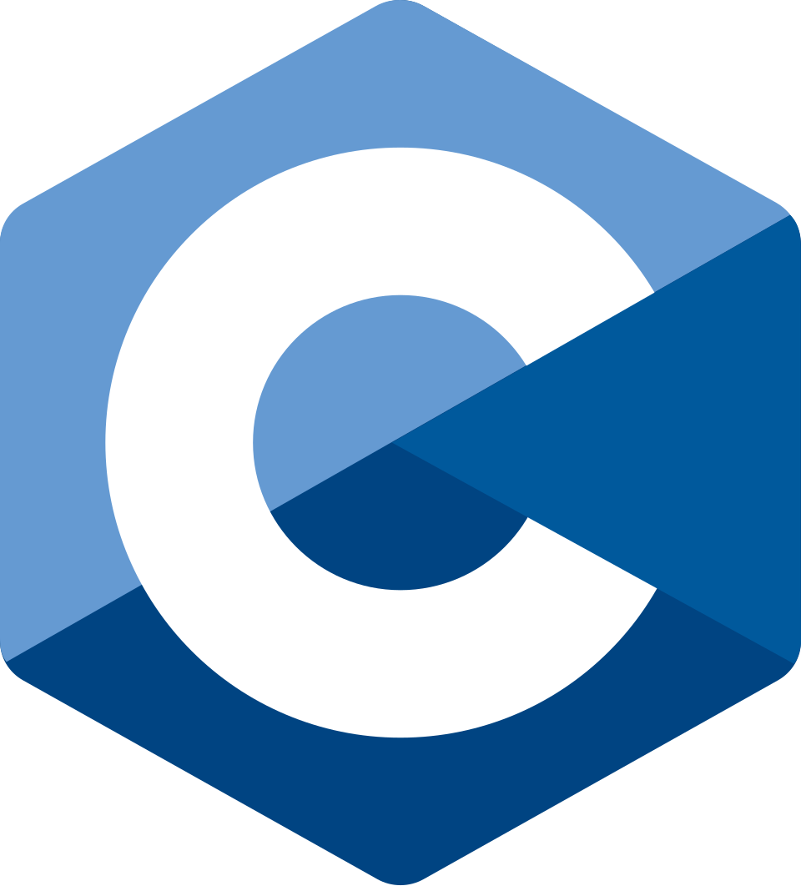
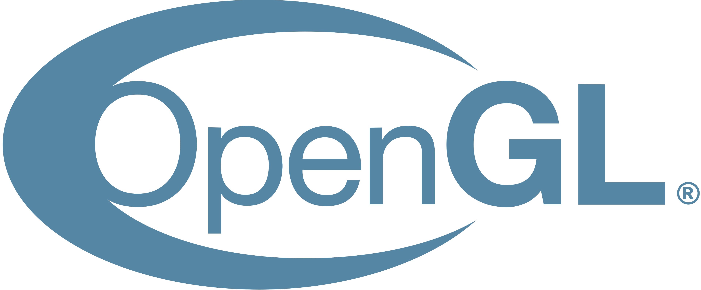
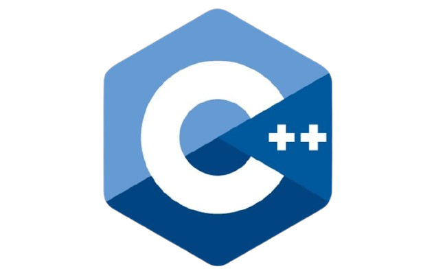

# Hello World!

```c
#define NAME "ColinDev"
#define PROFESSION "Student"

void programming();

int main(void) {
    do {
        programming();
    } while (1);

    return 0;
}
```

Hey, my name is Colin and I am still going to school. Nevertheless I found my hobby in programming and tech which I spend a lot or even all in my free time or after school. Most people do CS because of the money but not me - I love it, am very talented and good at it.
Especially low level programming, so I used C++ and now C for graphics programming, data structures from scratch, neural networks and more!
Here, I will share my progress and code, feel free to have a peek at what I do!

My goal is to make my OpenGL library for gamedev fully from C++ to C + the Minecraft Clone I made with C++ earlier.
Also I am trying to build my own std library from scratch with C too and with all that making cool projects f.e. games!
Now I firstly need to get very good and mastering the C programming language by using NeoVim on Arch Linux Hyprland (btw).
I also started making things with Arduino like a traffic light with LEDs and a D1 mini so I can additionally remote control it via web server + a game on a Arduino Mega 2560 R3 Board with a 2.8" TFT LCD Touchscreen.

I also share my progress on YouTube, rarely but sometimes on itch.io if I made a game which can be played on web (with Emscripten).

## Skills



## My "Roadmap"

2022 - Scratch \
2023 - C# and Unity Game Engine 4 \
May 2025 - C++ and Raylib \
October 2025 - C++ and OpenGL 3.3 \
January 2026 - C and OpenGL 3.3 \
May 2026 - Arduino (C++)
